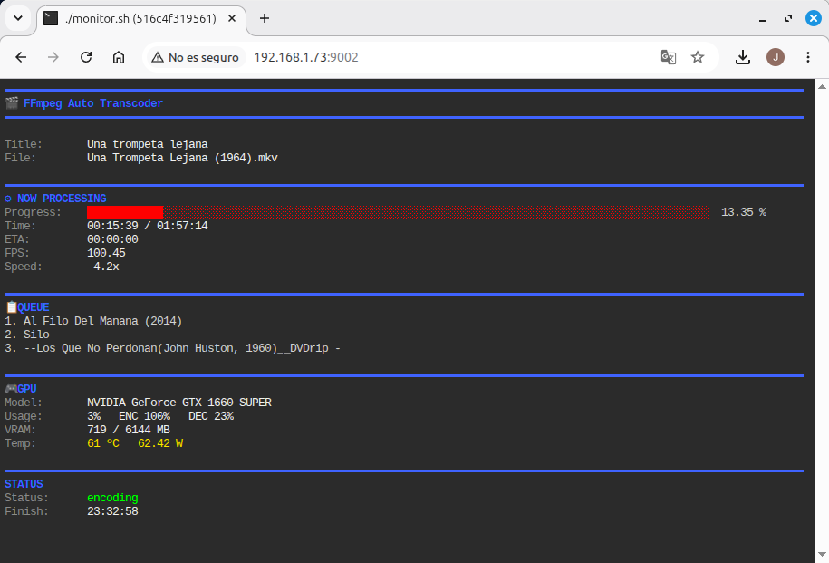
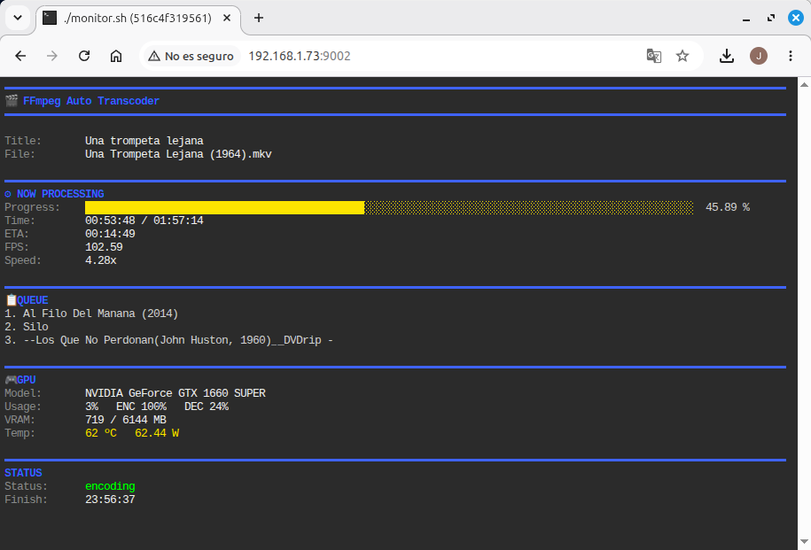
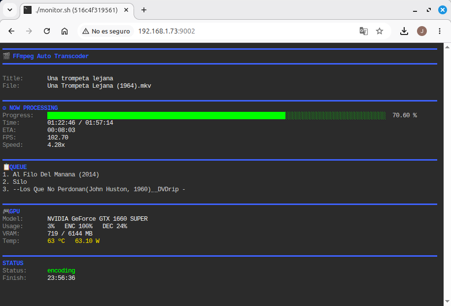

<h1 align="center">
  FFmpeg Auto Transcoder
</h1>

<p align="center">
Automatic movie transcoding for <b>Linux</b>, <b>Docker</b> and <b>NAS</b> using <b>FFmpeg</b> and <b>NVIDIA NVENC</b>.
</p>

<p align="center">


</p>

<p align="center">
Compatible with <b>Jellyfin</b>, <b>Plex</b>, <b>Emby</b> and other media servers.
</p>

<p align="center">
  
</p>
<p align="center">
  
</p>
<p align="center">
  
</p>

---

## Overview

**FFmpeg Auto Transcoder** is an automated movie transcoding service for Linux servers, Docker deployments, NAS systems and home media libraries. It integrates seamlessly with **Jellyfin**, **Plex**, **Emby**, and any media server that monitors local folders.

The application continuously watches an **incoming** directory, identifies new movies using **TMDb** and **OMDb**, transcodes them to **H.265/HEVC** using **NVIDIA NVENC** hardware acceleration, and automatically organizes the resulting files into a structured media library.

It can be installed either as a native Linux service or with **Docker Compose**, making it suitable for home servers, NAS devices and virtual machines. Once installed, it runs unattended, automatically processing every new movie placed in the monitored folder.

---

# Features

- 🎬 Automatic movie detection and processing
- 🚀 NVIDIA NVENC hardware-accelerated transcoding
- 📦 H.265 / HEVC video encoding
- 🎞️ Automatic movie identification using TMDb and OMDb
- 📁 Automatic media library organization
- 🌐 Real-time web monitor
- 🐳 Docker Compose deployment for Linux and NAS
- ⚙️ Native Linux installation with systemd integration
- 🔄 Automatic startup and service recovery
- 🛡️ Automatic recovery from stalled FFmpeg processes
- 📝 Detailed logging and processing history

---

# Project Structure

```text
ffmpeg-auto-transcoder/
├── transcoder.sh
├── monitor.sh
├── monitor-web.sh
├── install.sh
├── uninstall.sh
├── lib/
├── templates/
├── deploy/
│   └── docker/
└── README.md
```

---

## View the Logs

View logs from all containers:

```bash
docker compose logs -f
```

View only the transcoder logs:

```bash
docker compose logs -f transcoder
```

View only the monitor logs:

```bash
docker compose logs -f monitor
```

Press `Ctrl+C` to stop following the logs.

---

## Stop the Containers

```bash
docker compose down
```

---

## Restart the Containers

```bash
docker compose restart
```

---

## Update the Application

From the repository root:

```bash
git pull

cd deploy/docker

docker compose up -d --build
```

---

## Docker Configuration

All Docker configuration is managed directly in:

```text
deploy/docker/docker-compose.yml
```

No `.env` file is required.

Common options include:

- User ID and group ID
- Host media library path
- TMDb API key
- OMDb API key
- Time zone
- Target movie size
- Minimum movie duration
- Minimum video bitrate
- Output resolution: 4K, 1440p, 1080p or 720p

Each option is documented inside the Compose file.

---

# Configuration

All transcoding settings are stored in:

## Native Installation

```text
/etc/ffmpeg-auto-transcoder/config.sh
```

## Docker Deployment

Configuration is managed directly in:

```text
deploy/docker/docker-compose.yml
```

---

## TMDb and OMDb API Keys

Movie identification requires API keys from both services.

You can obtain free personal API keys here:

- TMDb: https://www.themoviedb.org/settings/api
- OMDb: https://www.omdbapi.com/apikey.aspx

Without valid API keys the application can still transcode movies, but automatic identification and renaming will be unavailable.

---

## Media Library

The application automatically manages the following directory structure:

```text
MEDIA_DIR/
├── incoming/
├── processing/
├── library/
├── completed/
├── failed/
├── logs/
└── temp/
```

When a new movie is copied into **incoming**, the application automatically:

1. Detects the new file.
2. Moves it to `processing`.
3. Identifies the movie using TMDb and OMDb.
4. Analyzes the media with FFprobe.
5. Transcodes it to H.265 / HEVC.
6. Saves the new file into `library`.
7. Moves the original movie to `completed`.

If transcoding fails, the original file is automatically moved to the `failed` directory.

---

## Output Resolution

The target resolution can be configured in either `config.sh` or `docker-compose.yml`.

Supported resolutions:

| Resolution | Width | Height |
|------------|------:|-------:|
| 4K UHD | 3840 | 2160 |
| 1440p | 2560 | 1440 |
| Full HD | 1920 | 1080 |
| HD | 1280 | 720 |

The transcoder always preserves the original aspect ratio, adding padding only when required.

---

# Web Monitor

A built-in web monitor provides a live view of the transcoding process from any browser.

During an active job it displays:

- Current movie
- Detected title
- Progress percentage
- Progress bar
- Elapsed time
- Estimated remaining time (ETA)
- Current FPS
- Encoding speed
- NVIDIA GPU utilization
- Encoder utilization
- Decoder utilization
- GPU memory usage
- GPU temperature
- GPU power consumption
- FFmpeg process ID

## Native Installation

```text
http://SERVER_IP:9001
```

Local access:

```text
http://localhost:9001
```

## Docker Deployment

```text
http://SERVER_IP:9002
```

Local access:

```text
http://localhost:9002
```

---

## Idle Mode

When no movie is being processed, the monitor automatically switches to an idle view showing:

- Service status
- GPU information
- Media library location
- Pending movie count
- Helpful management commands

The display refreshes automatically, allowing you to monitor the system in real time.

---

# How It Works

The application continuously watches the **incoming** directory for new movies.

Whenever a new file appears, the following workflow is executed automatically:

```text
incoming
    │
    ▼
processing
    │
    ├── Movie identification (TMDb / OMDb)
    ├── Media analysis (FFprobe)
    ├── Hardware transcoding (NVENC)
    ├── Progress monitoring
    └── Error detection
    │
    ▼
library
    │
    ▼
completed
```

If an unrecoverable error occurs, the original movie is automatically moved to:

```text
failed/
```

---

# Hardware Acceleration

FFmpeg Auto Transcoder uses **NVIDIA NVENC** hardware acceleration whenever a compatible GPU is available.

Supported features include:

- H.265 / HEVC hardware encoding
- Automatic GPU utilization monitoring
- Encoder and decoder utilization monitoring
- GPU memory usage reporting
- Automatic detection of stalled FFmpeg processes
- Automatic recovery from encoding failures

By offloading video encoding to the GPU, the application significantly reduces CPU usage while maintaining excellent transcoding performance.

---

# Logging

Detailed logs are stored in:

```text
MEDIA_DIR/logs/
```

The logs include transcoding activity, errors and progress information, making troubleshooting and auditing straightforward.

---

# Updating

Keeping the application up to date is simple.

First, update your local repository:

```bash
git pull
```

## Native Installation

Run the installer again:

```bash
sudo ./install.sh
```

The installer updates the application while preserving your existing configuration and media library.

## Docker Deployment

Rebuild and restart the containers:

```bash
docker compose up -d --build
```

---

# License

This project is released under the **MIT License**.

You are free to use, modify and distribute this software in accordance with the terms of the license.

---

# Contributing

Contributions are always welcome.

If you discover a bug, have an idea for a new feature or would like to improve the project, feel free to open an issue or submit a pull request.

Every contribution, no matter how small, is appreciated.

---

# Acknowledgements

This project would not be possible without the outstanding work of the following projects and communities:

- FFmpeg
- NVIDIA NVENC
- The Movie Database (TMDb)
- OMDb API
- ttyd

Many thanks to everyone involved in developing and maintaining these tools.

---

# Roadmap

Planned improvements for future releases include:

- Enhanced web dashboard
- Additional transcoding profiles
- Multi-language support
- Improved metadata handling
- Better Docker customization
- Expanded monitoring and statistics

Suggestions and feature requests are always welcome.

---

# FFmpeg Auto Transcoder

Automatically identify, transcode and organize your movie collection using **FFmpeg** and **NVIDIA NVENC**.

Designed to run unattended on **Linux**, **Docker** and **NAS** environments—simply copy your movies into the **incoming** directory and let the application handle the rest.

Happy transcoding! 🎬
