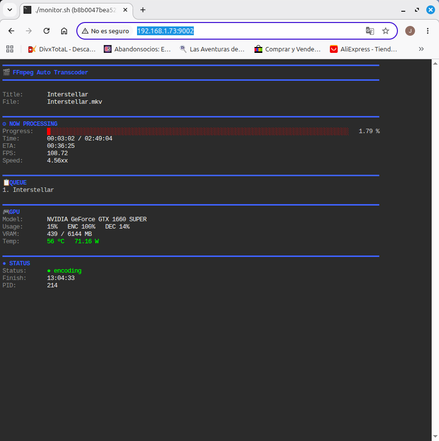

<h1 align="center">
  FFmpeg Auto Transcoder
</h1>

<p align="center">
Automatic movie transcoding for <b>Linux</b>, <b>Docker</b> and <b>NAS</b> using <b>FFmpeg</b> and <b>NVIDIA NVENC</b>.
</p>

<p align="center">


</p>

<p align="center">
Compatible with <b>Jellyfin</b>, <b>Plex</b>, <b>Emby</b> and other media servers.
</p>

<p align="center">
  
</p>

---

## Overview

**FFmpeg Auto Transcoder** is an automated movie transcoding service for Linux servers, NAS systems and home media libraries. It integrates seamlessly with **Jellyfin**, **Plex**, **Emby**, and any media server that monitors local folders.

The application continuously watches an **incoming** directory, identifies new movies using **TMDb** and **OMDb**, transcodes them to **H.265/HEVC** with **NVIDIA NVENC** hardware acceleration, and automatically organizes the resulting files into a structured media library.

It can be installed either as a native Linux service or with **Docker Compose**, making it suitable for home servers, NAS devices and virtual machines. Once installed, it runs unattended, automatically processing every new movie placed in the monitored folder.

---

# Features

- 🎬 Automatic movie detection and processing
- 🚀 NVIDIA NVENC hardware-accelerated transcoding
- 📦 H.265 / HEVC video encoding
- 🎞️ Automatic movie identification using TMDb and OMDb
- 📁 Automatic media library organization
- 🌐 Real-time web monitor
- 🐳 Docker Compose deployment for Linux and NAS
- ⚙️ Native Linux installation with systemd integration
- 🔄 Automatic startup and service recovery
- 🛡️ Automatic recovery from stalled FFmpeg processes
- 📝 Detailed logging and processing history

---

# Project Structure

```text
ffmpeg-auto-transcoder/
├── transcoder.sh
├── monitor.sh
├── monitor-web.sh
├── install.sh
├── uninstall.sh
├── lib/
├── templates/
├── deploy/
│   └── docker/
└── README.md
```

---

# Requirements

## Native Installation

Requirements:

- Linux (systemd-based distribution)
- NVIDIA GPU with NVENC support
- NVIDIA proprietary drivers
- Internet connection (TMDb / OMDb access)
- sudo privileges

The installer automatically installs all required dependencies, including:

- FFmpeg
- rsync
- jq
- curl
- bc
- ttyd

---

## Docker Deployment

Requirements:

- Docker Engine 29 or newer
- Docker Compose v2
- NVIDIA Container Toolkit
- NVIDIA GPU with NVENC support
- NVIDIA proprietary drivers
- Internet connection (TMDb / OMDb access)

The media library must be mounted as a writable bind mount using the configured `PUID` and `PGID`.

---

# Media Library Structure

When the containers start, the Docker entrypoint automatically creates the complete media library layout inside the configured media directory.

```text
MEDIA_DIR/
├── incoming/
├── processing/
├── library/
├── completed/
├── failed/
├── logs/
└── temp/
```

Simply copy a movie into the **incoming** directory and the transcoder will take care of the rest.

---

# Native Installation

Clone the repository:

```bash
git clone https://github.com/mcjmm1-git/ffmpeg-auto-transcoder.git

cd ffmpeg-auto-transcoder
```

Make the installer executable:

```bash
chmod +x install.sh
```

Run the installer:

```bash
sudo ./install.sh
```

During installation you will be asked for:

* Media library location
* TMDb API key
* OMDb API key

The installer automatically:

* Installs all required dependencies
* Creates the media library directory structure
* Copies the application to `/opt/ffmpeg-auto-transcoder`
* Generates the configuration files
* Installs and enables the required systemd services
* Starts both the transcoder and the web monitor

---

# Installed Services

Two services are installed automatically:

```text
transcoder.service
ffmpeg-monitor.service
```

Check their status:

```bash
sudo systemctl status transcoder.service

sudo systemctl status ffmpeg-monitor.service
```

Restart them:

```bash
sudo systemctl restart transcoder.service

sudo systemctl restart ffmpeg-monitor.service
```

Stop them:

```bash
sudo systemctl stop transcoder.service

sudo systemctl stop ffmpeg-monitor.service
```

---

# Uninstall

To completely remove the application:

```bash
sudo ./uninstall.sh
```

The uninstaller allows you to choose whether to keep or remove:

* Configuration files
* Media library

---

# Docker Installation

Clone the repository:

```bash
git clone https://github.com/mcjmm1-git/ffmpeg-auto-transcoder.git

cd ffmpeg-auto-transcoder/deploy/docker
```

Open the Docker Compose configuration:

```bash
nano docker-compose.yml
```

Configure the required values directly inside `docker-compose.yml`:

* `PUID`
* `PGID`
* Host media library path
* `TMDB_API_KEY`
* `OMDB_API_KEY`
* Time zone
* Transcoding options

You can obtain your user and group IDs with:

```bash
id
```

Example:

```text
uid=1000(john) gid=1000(john) groups=1000(john)
```

Make sure the configured host media directory exists and is writable by the selected `PUID` and `PGID`.

---

## Build and Start

Build the image and start the containers:

```bash
docker compose up -d --build
```

For subsequent starts:

```bash
docker compose up -d
```

The Docker entrypoint automatically creates all required media library subdirectories when the containers start.

---

## Check the Containers

```bash
docker compose ps
```

---

## Web Monitor

The web monitor is available at:

```text
http://SERVER_IP:9002
```

When accessing it from the same machine:

```text
http://localhost:9002
```

---

## View the Logs

View logs from all containers:

```bash
docker compose logs -f
```

View only the transcoder logs:

```bash
docker compose logs -f transcoder
```

View only the monitor logs:

```bash
docker compose logs -f monitor
```

Press `Ctrl+C` to stop following the logs.

---

## Stop the Containers

```bash
docker compose down
```

---

## Restart the Containers

```bash
docker compose restart
```

---

## Update the Application

From the repository root:

```bash
git pull

cd deploy/docker

docker compose up -d --build
```

---

## Docker Configuration

All Docker configuration is managed directly in:

```text
deploy/docker/docker-compose.yml
```

No `.env` file is required.

Common options include:

* User ID and group ID
* Host media library path
* TMDb API key
* OMDb API key
* Time zone
* Target movie size
* Minimum movie duration
* Minimum video bitrate
* Output resolution: 4K, 1440p, 1080p or 720p

Each option is documented inside the Compose file.


---

# Configuration

All transcoding settings are stored in a single configuration file.

## Native Installation

```text
/etc/ffmpeg-auto-transcoder/config.sh
```

## Docker Deployment

Configuration is provided through:

- `.env`
- `docker-compose.yml`

---

## TMDb and OMDb API Keys

Movie identification requires API keys from both services.

You can obtain free personal API keys here:

- TMDb: https://www.themoviedb.org/settings/api
- OMDb: https://www.omdbapi.com/apikey.aspx

Without valid API keys the application can still transcode movies, but automatic identification and renaming will be unavailable.

---

## Media Library

The application manages the following directory structure automatically:

```text
MEDIA_DIR/
├── incoming/
├── processing/
├── library/
├── completed/
├── failed/
├── logs/
└── temp/
```

The workflow is completely automatic.

When a new movie is copied into **incoming**, the application will:

1. Detect the new file.
2. Move it to `processing`.
3. Identify the movie using TMDb and OMDb.
4. Analyze the media with FFprobe.
5. Transcode it to H.265 / HEVC.
6. Save the new file into `library`.
7. Move the original movie to `completed`.

If the transcoding process fails, the original file is automatically moved to the `failed` directory.

---

## Output Resolution

The target resolution can be configured in either `config.sh` or `docker-compose.yml`.

Supported examples:

| Resolution | Width | Height |
|------------|------:|-------:|
| 4K UHD | 3840 | 2160 |
| 1440p | 2560 | 1440 |
| Full HD | 1920 | 1080 |
| HD | 1280 | 720 |

The transcoder always preserves the original aspect ratio, adding padding only when required.

---

# Web Monitor

A built-in web monitor provides a live view of the transcoding process from any browser.

During an active job it displays:

- Current movie
- Detected title
- Progress percentage
- Progress bar
- Elapsed time
- Estimated remaining time (ETA)
- Current FPS
- Encoding speed
- NVIDIA GPU utilization
- Encoder utilization
- Decoder utilization
- GPU memory usage
- GPU temperature
- GPU power consumption
- FFmpeg process ID

---

## Native Installation

Once installed, the monitor is available at:

```text
http://SERVER_IP:9001
```

Example:

```text
http://192.168.1.100:9001
```

---

## Docker Deployment

Expose port **9001** in your `docker-compose.yml`:

```yaml
ports:
  - "9001:9001"
```

Then open:

```text
http://SERVER_IP:9001
```

from any browser connected to the same network.

---

## Idle Mode

When no movie is being processed, the monitor automatically switches to an idle view showing useful system information, including:

- Service status
- GPU information
- Media library location
- Pending movie count
- Helpful management commands

The display refreshes automatically, allowing you to monitor the system in real time without any manual interaction.

---

# How It Works

The application continuously watches the **incoming** directory for new movies.

Whenever a new file appears, the following workflow is executed automatically:

```text
incoming
    │
    ▼
processing
    │
    ├── Movie identification (TMDb / OMDb)
    ├── Media analysis (FFprobe)
    ├── Hardware transcoding (NVENC)
    ├── Progress monitoring
    └── Error detection
    │
    ▼
library
    │
    ▼
completed
```

If an unrecoverable error occurs, the original movie is safely moved to:

```text
failed/
```
# Hardware Acceleration

FFmpeg Auto Transcoder takes advantage of **NVIDIA NVENC** hardware acceleration whenever a compatible GPU is available.

Supported features include:

- H.265 / HEVC hardware encoding
- Automatic GPU utilization monitoring
- Encoder and decoder utilization monitoring
- GPU memory usage reporting
- Automatic detection of stalled FFmpeg processes
- Automatic recovery from encoding failures

By offloading video encoding to the GPU, the application significantly reduces CPU usage while maintaining excellent transcoding performance.

---

# Logging

Detailed logs are stored inside the media library:

```text
MEDIA_DIR/logs/
```

These logs include transcoding activity, errors and progress information, making troubleshooting and auditing straightforward.

---

# Updating

Keeping the application up to date is simple.

First, update your local repository:

```bash
git pull
```

## Native Installation

Run the installer again:

```bash
sudo ./install.sh
```

The installer updates the application while preserving your existing configuration and media library.

---

## Docker Deployment

Rebuild and restart the container:

```bash
docker compose up -d --build
```

---

# License

This project is released under the **MIT License**.

You are free to use, modify and distribute this software in accordance with the terms of the license.

---

# Contributing

Contributions are always welcome.

If you discover a bug, have an idea for a new feature or would like to improve the project, feel free to open an issue or submit a pull request.

Every contribution, no matter how small, is appreciated.

---

# Acknowledgements

This project would not be possible without the outstanding work of the following projects and communities:

- FFmpeg
- NVIDIA NVENC
- The Movie Database (TMDb)
- OMDb API
- ttyd

Many thanks to everyone involved in developing and maintaining these tools.

---

# Roadmap

Planned improvements for future releases include:

- Enhanced web dashboard
- Additional transcoding profiles
- Multi-language support
- Improved metadata handling
- Better Docker customization
- Expanded monitoring and statistics

Suggestions and feature requests are always welcome.

---

# FFmpeg Auto Transcoder

Automatically identify, transcode and organize your movie collection using **FFmpeg** and **NVIDIA NVENC**.

Designed to work unattended, so you only need to copy your movies into the **incoming** directory and let the application handle the rest.

Happy transcoding! 🎬
